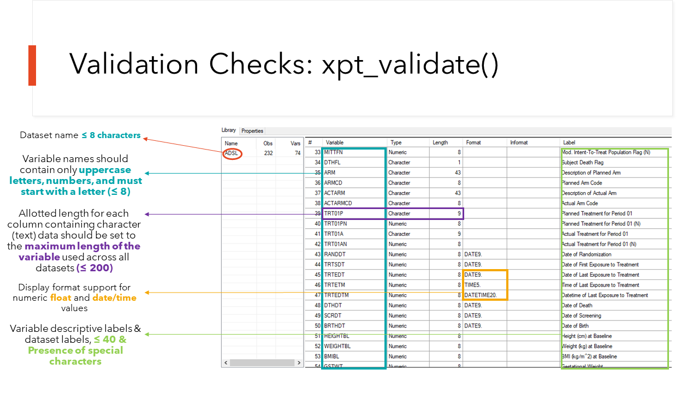

```{r, include = FALSE}
knitr::opts_chunk$set(
  collapse = TRUE,
  comment = " "
)

options(cli.num_colors = 1)

library(DT)
```

```{r, include=FALSE}
# Used to control str() output later on

local({
  hook_output <- knitr::knit_hooks$get("output")
  knitr::knit_hooks$set(output = function(x, options) {
    if (!is.null(options$max.height)) {
      options$attr.output <- c(
        options$attr.output,
        sprintf('style="max-height: %s;"', options$max.height)
      )
    }
    hook_output(x, options)
  })
})
```

```{css, echo=FALSE}
/* Used to control DT outputs */
.text-left {
  text-align: left;
}
```

# Introduction

This vignette will explore in detail all the possibilities of the `{xportr}` package for applying information from a metadata object to an R created dataset using the core `{xportr}` functions. 

We will also explore the following:

* What goes in a Submission to a Health Authority, and what role does `{xportr}` play in that Submission?
* What is `{xportr}` validating behind the scenes?
* Breakdown of `{xportr}` and a ADaM dataset specification file.
* Using `options()` and `xportr_metadata()` to enhance your `{xportr}` experience.
* Understanding the warning and error messages for each `{xportr}` function.
* A brief discussion on future work.


**NOTE:** We use the phrase _metadata object_ throughout this package.  A _metadata object_ can either be a specification file read into R as a dataframe or a `{metacore}` object. The _metadata object_ created via the `{metacore}` package has additional features not covered here, but at its core is using a specification file. However, `{xportr}` will work with either a dataframe or a `{metacore}` object.

# What goes in a Submission to a Health Authority?

Quite a bit!  We will focus on the data deliverables and supporting documentation needed for a successful submission to a Health Authority and how `{xportr}` can play a key role. We will briefly look at three parts: 

1) Study Data Standardization Plan
2) SDTM Data Package
3) ADaM Data Package

## Study Data Standardization Plan

The Study Data Standardization Plan (SDSP) establishes and documents a plan for describing the data standardization approach for clinical and nonclinical studies within a development program. The SDSP also assists the FDA in identifying potential data standardization issues early in the development program. We hope the brevity of this section does not belie the huge importance of this document. Please see [Study Data Standardisation Plan (SDSP) Package](https://advance.phuse.global/display/WEL/Study+Data+Standardisation+Plan+%28SDSP%29+Package) maintained by the [PHUSE working group](https://advance.phuse.global/display/WEL/Welcome+to+the+PHUSE+Advance+Hub).  However, we want to focus more on the actual data and how `{xportr}` can play a role in the submission.

## SDTM and ADaM Data Packages

__SDTM:__ The primary pieces of the SDTM package are the SDTM annotated case report forms (acrf.pdf), the data definitions document (define.xml), the Study Data Reviewer's Guide (sdrg.pdf) and the datasets in xpt Version 5 format.  The Version 5 xpt file is the **required** submission format for all datasets going to the Health Authorities.  

__ADaM:__ The key components of the ADaM package are very similar to SDTM package with a few additions: define.xml, Analysis Study Data Reviewer's Guide (adrg.pdf), Analysis Results Metadata (analysis-results-metadata.pdf) and datasets as Version 5 xpt format.

As both Data Packages need compliant `xpt` files, we feel that `{xportr}` can play a pivotal role here. The core functions in `{xportr}` can be used to apply information from the _metadata object_ to the datasets giving users feedback on the quality of the metadata and data. `xportr_write()` can then be used to write out the final dataset as an `xpt` file, which can be submitted to a Health Authority.

## What is `{xportr}` validating in these Data Packages?

The `xpt` Version 5 files form the backbone of any successful Submission and are govern by quite a lot of rules and suggested guidelines. As you are preparing your data packages for submission the suite of core `{xportr}` functions, plus `xportr_write()`, helps to check that your datasets are submission compliant. The package checks many of the latest rules laid out in the [Study Data Technical Conformance Guide](https://www.fda.gov/regulatory-information/search-fda-guidance-documents/study-data-technical-conformance-guide-technical-specifications-document), but please note that it is not yet an exhaustive list of checks. We envision that users are also submitting their `xpts` and metadata to additional validation software.

Each of the core `{xportr}` functions for applying labels, types, formats, order and lengths provides feedback to users on submission compliance. However, a final check is implemented when `xportr_write()` is called to create the `xpt`. `xportr_write()` calls [`xpt_validate()`](https://github.com/atorus-research/xportr/blob/231e959b84aa0f1e71113c85332de33a827e650a/R/utils-xportr.R#L174), which is a behind the scenes/non-exported function that does a final check for compliance.  At the time of `{xportr} v0.3.0` we are checking the following when a user writes out an `xpt` file.:



# {xportr} in action

In this section, we are going to explore the 5 core `{xportr}` functions using: 

* `xportr::adsl` - An ADSL ADaM dataset from the Pilot 3 Submission to the FDA
* `xportr::var_spec` - The ADSL ADaM Specification File from the Pilot 3 Submission to the FDA

We will focus on warning and error messaging with contrived examples from these functions by manipulating either the datasets or the specification files.

**NOTE:** We have made the ADSL and Spec available in this package. Users can find additional datasets and specification files on our [repo](https://github.com/atorus-research/xportr) in the `example_data_specs` folder. This is to keep the package to a minimum size.  


## Using `options()` and `xportr_metadata()` to enhance your experience.

Before we dive into the functions, we want to point out some quality of life utilities to make your `xpt` generation life a little bit easier.

* `options()` 
* `xportr_metadata()` 

**NOTE:** As long as you have a well-defined _metadata object_ you do NOT need to use `options()` or `xportr_metadata()`, but we find these handy to use and think they deserve a quick mention!

## You got `options()`

`{xportr}` is built with certain assumptions around specification column names and information in those columns. We have found that each company specification file can differ slightly from our assumptions. For example, one company might call a column `Variables`, another `Variable` and another `variables`.  Rather than trying to regex ourselves out of this situation, we have introduced `options()`.  `options()` allows users to control those assumptions inside `{xportr}` functions based on their needs.

Let's take a look at our example specification file names available in this package. We can see that all the columns start with an upper case letter and have spaces in several of them. We could convert all the column names to lower case and deal with the spacing using some `{dplyr}` functions or base R, or we could just use `options()`! 

```{r, message = FALSE}
library(rlang)
library(xportr)
library(dplyr)
library(haven)

colnames(var_spec)
```

By using `options()` at the beginning of our script we can tell `{xportr}` what the valid names are (see chunk below). Please note that before we set the options the package assumed every thing was in lowercase and there were no spaces in the names. After running `options()`, `{xportr}` sees the column `Variable` as the valid name rather than `variable`.  You can inspect [`zzz.R`](https://github.com/atorus-research/xportr/blob/main/R/zzz.R) to look at additional options.

```{r, eval = FALSE}
options(
  xportr.variable_name = "Variable",
  xportr.label = "Label",
  xportr.type_name = "Data Type",
  xportr.format = "Format",
  xportr.length = "Length",
  xportr.order_name = "Order"
)
```

## Are we being too verbose?

One final note on `options()`.  4 of the core `{xportr}` functions have the ability to set messaging as `"none", "message", "warn", "stop"`. Setting each of these in all your calls can be a bit repetitive.  You can use `options()` to set these at a higher level and avoid this repetition.

```{r, eval = FALSE}
# Default
options(
  xportr.format_verbose = "none",
  xportr.label_verbose = "none",
  xportr.length_verbose = "none",
  xportr.type_verbose = "none",
)

# Will send Warning Message to Console
options(
  xportr.format_verbose = "warn",
  xportr.label_verbose = "warn",
  xportr.length_verbose = "warn",
  xportr.type_verbose = "warn",
)
```

## Going meta

Each of the core `{xportr}` functions requires several inputs: A valid dataframe, a metadata object and a domain name, along with optional messaging. For example, here is a simple call using all of the functions. As you can see, a lot of information is repeated in each call.     

```{r, eval = FALSE}
adsl %>%
  xportr_type(var_spec, "ADSL", "message") %>%
  xportr_length(var_spec, "ADSL", "message") %>%
  xportr_label(var_spec, "ADSL", "message") %>%
  xportr_order(var_spec, "ADSL", "message") %>%
  xportr_format(var_spec, "ADSL") %>%
  xportr_write("adsl.xpt", label = "Subject-Level Analysis Dataset")
```

To help reduce these repetitive calls, we have created `xportr_metadata()`. A user can just **set** the _metadata object_ and the Domain name in the first call, and this will be passed on to the other functions.  Much cleaner!


```{r, eval = FALSE}
adsl %>%
  xportr_metadata(var_spec, "ADSL") %>%
  xportr_type() %>%
  xportr_length() %>%
  xportr_label() %>%
  xportr_order() %>%
  xportr_format() %>%
  xportr_write("adsl.xpt", label = "Subject-Level Analysis Dataset")
```


## Warnings and Errors 

For the next six sections, we are going to explore the Warnings and Errors messages generated by the `{xportr}` core functions. To better explore these, we will either manipulate the ADaM dataset or specification file to help showcase the ability of the `{xportr}` functions to detect issues.  

**NOTE:** We have made the ADSL, `xportr::adsl`, and Specification File, `xportr::var_spec`, available in this package. Users can find additional datasets and specification files on our [repo](https://github.com/atorus-research/xportr) in the `example_data_specs` folder. 

### Setting up our metadata object

First, let's read in the specification file and call it `var_spec`.  Note that we are not using `options()` here.  We will do some slight manipulation to the column names by doing all lower case, and changing `Data Type` to `type` and making the Order column numeric. You can also use `options()` for this step as well.  The `var_spec` object has five dataset specification files stacked on top of each other. We will make use of the `ADSL` subset of `var_spec`. You can make use of the Search field above the dataset column to subset the specification file for `ADSL`

```{r}
var_spec <- var_spec %>%
  rename(type = "Data Type") %>%
  set_names(tolower)
```

```{r, echo = FALSE}
columns2hide <- c(
  "significant digits", "mandatory", "assigned value", "codelist", "common",
  "origin", "pages", "method", "predecessor", "role", "comment",
  "developer notes"
)

datatable(
  var_spec %>% select(-all_of(columns2hide)),
  rownames = FALSE,
  filter = "top",
  options = list(
    dom = "Bfrtip",
    columnDefs = list(
      list(
        width = "10px",
        targets = c("order", "length", "format", "type", "dataset", "variable")
      ),
      list(
        className = "text-left",
        targets = c("label")
      )
    ),
    searching = FALSE,
    autoWidth = TRUE
  )
) %>%
  formatStyle(0,
    target = "row",
    color = "black",
    backgroundColor = "white",
    fontWeight = "500",
    lineHeight = "85%",
    textAlign = "center",
    fontSize = ".875em" # same as code
  )
```

## `xportr_type()`

We are going to explore the type column in the metadata object. A submission to a Health Authority should only have character and numeric types in the data. In the  `ADSL` data we  have several columns that are in the Date type: `TRTSDT`, `TRTEDT`, `DISONSDT`, `VISIT1DT` and `RFENDT` - under the hood these are actually numeric values and will be left as is. We will change one variable type to a [factor variable](https://forcats.tidyverse.org/), which is a common data structure in R, to give us some educational opportunities to see `xportr_type()` in action. 

```{r}
adsl_fct <- adsl %>%
  mutate(STUDYID = as_factor(STUDYID))
```

```{r, echo = FALSE}
adsl_glimpse <- adsl_fct %>%
  select(STUDYID, TRTSDT, TRTEDT, DISONSDT, VISIT1DT, RFENDT)
```

```{r, echo = FALSE}
glimpse(adsl_glimpse)
```

```{r, echo = TRUE}
adsl_type <- xportr_type(.df = adsl_fct, metadata = var_spec, domain = "ADSL", verbose = "warn")
```

```{r, echo = FALSE}
adsl_type_glimpse <- adsl_type %>%
  select(STUDYID, TRTSDT, TRTEDT, DISONSDT, VISIT1DT, RFENDT)
```

Success! As we can see below, `xportr_type()` applied the types from the metadata object to the `STUDYID` variables converting to the proper type. The functions in `{xportr}` also display this coercion to the user in the console, which is seen above.  

```{r, echo = TRUE}
glimpse(adsl_type_glimpse)
```

Note that `xportr_type(verbose = "warn")` was set so the function has provided feedback, which would show up in the console, on which variables were converted as a warning message. However, you can set `verbose = "stop"` so that the types are not applied if the data does not match what is in the specification file. Using `verbose = "stop"` will instantly stop the processing of this function and not create the object. A user will need to alter the variables in their R script before using `xportr_type()` 

```{r, echo = TRUE, error = TRUE}
adsl_type <- xportr_type(.df = adsl, metadata = var_spec, domain = "ADSL", verbose = "stop")
```

## `xportr_length()`

Next we will use `xportr_length()` to apply the length column of the _metadata object_ to the `ADSL` dataset. Using the `str()` function we have displayed all the variables with their attributes.  You can see that each variable has a label, but there is no information on the lengths of the variable. 

```{r, max.height='300px', attr.output='.numberLines', echo = FALSE}
str(adsl)
```

```{r, echo = TRUE}
adsl_length <- xportr_length(.df = adsl, metadata = var_spec, domain = "ADSL", verbose = "warn")
```

Using `xportr_length()` with `verbose = "warn"` we can apply the length column to all the columns in the dataset.  The function detects that two variables, `TRTDUR` and `DCREASCD` are missing from the metadata file. Note that the variables have slight misspellings in the dataset and metadata, which is a great catch! However, lengths are still applied with TRTDUR being give a length of 8 and DCREASCD a length of 200.

Using the `str()` function, you can see below that `xportr_length()` successfully applied all the lengths of the variable to the variables in the dataset.  


```{r, max.height='300px', attr.output='.numberLines', echo = FALSE}
str(adsl_length)
```

Just like we did for `xportr_type()`, setting `verbose = "stop"` immediately stops R from processing the lengths. Here the function detects the missing variables and will not apply any lengths to the dataset until corrective action is applied.

```{r, echo = TRUE, error = TRUE}
adsl_length <- xportr_length(.df = adsl, metadata = var_spec, domain = "ADSL", verbose = "stop")
```


## `xportr_label()`

As you are creating your dataset in R you will often find that R removes the label of your variable. Using `xportr_label()` you can easily re-apply all your labels to your variables in one quick action.  

For this example, we are going to manipulate both the metadata and the `ADSL` dataset:

* The metadata will have the variable `TRTSDT` label be greater than 40 characters. 
* The `ADSL` dataset will have all its labels stripped from it.

Remember in the length example, the labels were on the original dataset as seen in the `str()` output.

```{r, echo = TRUE}
var_spec_lbl <- var_spec %>%
  mutate(label = if_else(variable == "TRTSDT",
    "Length of variable label must be 40 characters or less", label
  ))

adsl_lbl <- adsl

adsl_lbl <- haven::zap_label(adsl)
```

We have successfully removed all the labels.

```{r, max.height='300px', attr.output='.numberLines', echo = FALSE}
str(adsl_lbl)
```

Using `xportr_label()` we will apply all the labels from our metadata to the dataset. Please note again that we are using `verbose = "warn"` and the same two issues for `TRTDUR` and `DCREASCD` are reported as missing from the metadata file.  An additional message is sent around the `TRTSDT` label having a length of greater than 40.

```{r}
adsl_lbl <- xportr_label(.df = adsl_lbl, metadata = var_spec_lbl, domain = "ADSL", verbose = "warn")
```

Success! All labels have been applied that are present in the both the metadata and the dataset. However, please note that the `TRTSDT` variable has had the label with characters greater than 40 **applied** to the dataset and the `TRTDUR` and `DCREASCD` have empty variable labels.  

```{r, max.height='300px', attr.output='.numberLines', echo = FALSE}
str(adsl_lbl)
```

Just like we did for the other functions, setting `verbose = "stop"` immediately stops R from processing the labels. Here the function detects the mismatches between the variables and labels as well as the label that is greater than 40 characters. As this stops the process, none of the labels will be applied to the dataset until corrective action is applied.

```{r, echo = TRUE, error = TRUE}
adsl_label <- xportr_label(.df = adsl_lbl, metadata = var_spec_lbl, domain = "ADSL", verbose = "stop")
```

## `xportr_order()`

The order of the dataset can greatly increase readability of the dataset for downstream stakeholders.  For example, having all the treatment related variables or analysis variables grouped together can help with inspection and understanding of the dataset. `xportr_order()` can take the order information from the metadata and apply it to your dataset.

```{r}
adsl_ord <- xportr_order(.df = adsl, metadata = var_spec, domain = "ADSL", verbose = "warn")
```

Readers are encouraged to inspect the dataset and metadata to see the past order and updated order after calling the function. Note the messaging from `xportr_order()`:

* Variables not in the metadata are moved to the end
* Variables not in order are re-ordered and a message is printed out on which ones were re-ordered.


```{r, echo = TRUE, error = TRUE}
adsl_ord <- xportr_order(.df = adsl, metadata = var_spec, domain = "ADSL", verbose = "stop")
```

Just like we did for the other functions, setting `verbose = "stop"` immediately stops R from processing the order. If variables or metadata are missing from either, the re-ordering will not process until corrective action is performed.

## `xportr_format()`

Formats play an important role in the SAS language and have a column in specification files. Being able to easily apply formats into your `xpt` file will allow downstream users of SAS to quickly format the data appropriately when reading into a SAS-based system.  `xportr_format()` can take these formats and apply them. Please reference `xportr_length()` or `xportr_label()` to note the missing `attr()` for formats in our `ADSL` dataset.

This example is slightly different from previous examples. You will need to use `xportr_type()` to coerce R Date variables and others types to character or numeric. Only then can you use `xportr_format()` to apply the format column to the dataset.

```{r, echo = TRUE}
adsl_fmt <- adsl %>%
  xportr_type(metadata = var_spec, domain = "ADSL", verbose = "warn") %>%
  xportr_format(metadata = var_spec, domain = "ADSL")
```

Success! We have taken the metadata formats and applied them to the dataset. Please inspect variables like `TRTSDT` or `DISONSDT` to see the `DATE9.` format being applied.

```{r, max.height='300px', attr.output='.numberLines', echo = FALSE}
str(adsl_fmt)
```

At the time of `{xportr} v0.3.0` we have not implemented any warnings or error messaging for this function. However, `xportr_write()` through `xpt_validate()` will check that formats applied are valid SAS formats.

## `xportr_write()`

Finally, we want to write out an `xpt` dataset with all our metadata applied. 

We will make use of `xportr_metadata()` to reduce repetitive metadata and domain specifications. We will use default option for verbose, which is just `message` and so not set anything for `verbose`. In `xportr_write()` we will specify the path, which will just be our current working directory, set the dataset label and toggle the `strict_checks` to be `FALSE`.  

```{r, echo = TRUE, error = TRUE}
adsl %>%
  xportr_metadata(var_spec, "ADSL") %>%
  xportr_type() %>%
  xportr_length() %>%
  xportr_label() %>%
  xportr_order() %>%
  xportr_format() %>%
  xportr_write(path = "adsl.xpt", label = "Subject-Level Analysis Dataset", strict_checks = FALSE)
```

Success! We have applied types, lengths, labels, ordering and formats to our dataset. Note the messages written out to the console. Remember the `TRTDUR` and `DCREASCD` and how these are not present in the metadata, but in the dataset. This impacts the messaging for lengths and labels where `{xportr}` is printing out some feedback to us on the two issues. 5 types are coerced, as well as 36 variables re-ordered. Note that `strict_checks` was set to `FALSE`.

The next two examples showcase the `strict_checks = TRUE` option in `xportr_write()` where we will look at formats and labels.

```{r, echo = TRUE, error = TRUE}
adsl %>%
  xportr_write(path = "adsl.xpt", label = "Subject-Level Analysis Dataset", strict_checks = TRUE)
```


As there at several `---DT` type variables, `xportr_write()` detects the lack of formats being applied. To correct this remember you can use `xportr_type()` and `xportr_format()` to apply formats to your xpt dataset.

Below we have manipulated the labels to again be greater than 40 characters for `TRTSDT`. We have turned off `xportr_label()` verbose options to only produce a message. However, `xportr_write()` with `strict_checks = TRUE` will error out as this is one of the many `xpt_validate()` checks going on behind the scenes.

```{r, echo = TRUE, error = TRUE}
var_spec_lbl <- var_spec %>%
  mutate(label = if_else(variable == "TRTSDT",
    "Length of variable label must be 40 characters or less", label
  ))


adsl %>%
  xportr_metadata(var_spec_lbl, "ADSL") %>%
  xportr_label() %>%
  xportr_type() %>%
  xportr_format() %>%
  xportr_write(path = "adsl.xpt", label = "Subject-Level Analysis Dataset", strict_checks = TRUE)
```


## Future Work

`{xportr}` is still undergoing development.  We hope to produce more vignettes and functions that will allow users to bulk process multiple datasets as well as have examples of piping `xpt` files and related documentation to a validation software service. As always, please let us know of any feature requests, documentation updates or bugs on [our GitHub repo](https://github.com/Atorus-Research/xportr/issues).
